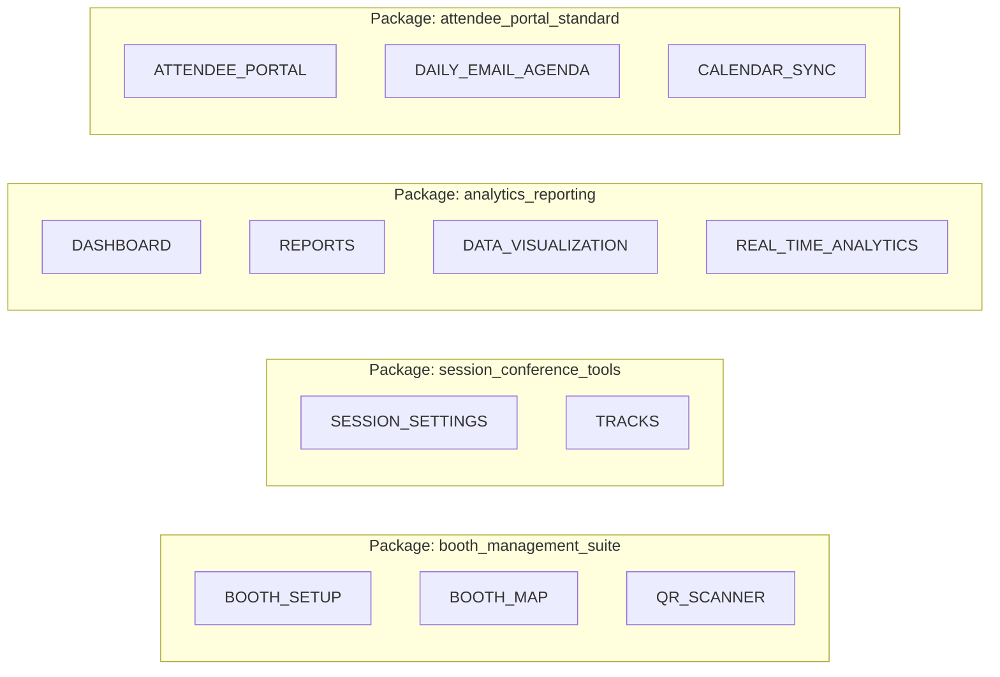

# Auditoría Completa del Sistema LyVenTum
**Fecha:** 2026-01-03

---

## 1. Resultados de Simulación Completa ✅

### Debug Simulation - Resultados

| Prueba | Resultado | Detalle |
|--------|-----------|---------|
| Crear Simulation User | ✅ Pass | Usuario de prueba creado |
| Crear Simulation Booth | ✅ Pass | Booth de prueba creado |
| Crear Sessions | ✅ Pass | 2 sesiones: "Simulated Open Keynote", "Sim Workshop" |
| Primer Scan | ✅ Pass | Registrado correctamente |
| Deduplicación | ✅ Pass | "Frequent Scan" detectado |
| Schedule Gating | ✅ Pass | OUT_OF_SCHEDULE detected |
| Persistencia en DB | ✅ Pass | Datos visibles en Dashboard |

### Screenshots de Evidencia

````carousel

<!-- slide -->

<!-- slide -->

````

---

## 2. Arquitectura de Features: Antes vs Ahora

### Sistema Anterior: 33 Features Individuales

```typescript
// src/features.ts - 33 features granulares
enum Feature {
  CHECK_IN_DESK, CHECK_IN_PHOTO,
  ATTENDEE_LOCATOR,
  DASHBOARD, DATA_VISUALIZATION, REAL_TIME_ANALYTICS, REPORTS,
  ATTENDEE_PROFILES, DATA_EDITOR,
  SESSION_SETTINGS, BOOTH_SETUP, TRACKS, BOOTH_MAP,
  MASTER_IMPORT, ATTENDEE_REGISTRATION, QR_SCANNER,
  SUPER_ADMIN_PLANS,
  ATTENDEE_CHAT, ATTENDEE_ALERTS,
  ATTENDEE_PORTAL_PREVIEW, ATTENDEE_PORTAL,
  DAILY_EMAIL_AGENDA, SESSION_REMINDERS, ATTENDEE_JOURNEY_VIEW,
  CALENDAR_SYNC, BOOTH_CHALLENGE, ACHIEVEMENT_SYSTEM,
  ATTENDEE_NETWORKING, LEADERBOARD,
  ANALYTICS, EMAIL_COMMUNICATIONS, VENDOR_PROFILES,
  ACCESS_CODES, EMAIL_SETTINGS, SPONSORSHIP,
  ATTENDEE_IMPORT, SCANNER, MY_EVENTS
}
```

### Sistema Nuevo: 9 Feature Packages

```typescript
// useFeatureAccess.ts - 9 paquetes
type FeaturePackageKey =
  | 'booth_management_suite'      // Booths, QR, Maps
  | 'session_conference_tools'    // Sessions, Tracks, Schedule
  | 'lead_capture_pro'            // Lead forms, Notes, Export
  | 'analytics_reporting'         // Reports, Visualizations, Dashboard
  | 'attendee_portal_standard'    // Portal, Agenda, Calendar
  | 'gamification_engagement'     // Badges, Leaderboard, Challenges
  | 'live_operations'             // Real-time, Alerts, Locator
  | 'communication_tools'         // Email, Notifications, Chat
  | 'sponsorship_management';     // Sponsors, Profiles, Branding
```

---

## 3. Mapeo: Features → Packages



---

## 4. Modelo de Datos en Supabase

### Tablas Involucradas

```
plans                    # Planes comerciales (Free, Pro, Enterprise)
  └─ plan_packages       # Relación M:N → qué packages incluye cada plan
      └─ feature_packages # Los 9 paquetes con array de features[]
          └─ features[]   # Array de feature_keys dentro del package

events
  └─ plan_id  ────────── FK → plans.id
```

### Flujo de Verificación

```
1. Usuario selecciona evento (selectedEventId)
2. useFeatureAccess obtiene events.plan_id
3. Query plan_packages donde plan_id = evento.plan_id
4. JOIN con feature_packages para obtener .key
5. Devuelve array de FeaturePackageKey[]
6. hasPackage('analytics_reporting') → true/false
```

---

## 5. Cómo Funciona el Feature Gating

### En Rutas (App.tsx)

```tsx
// Ruta protegida por Feature
<Route path={AppRoute.Reports} element={
  <ProtectedRoute allowedRoles={['admin', 'organizer']}>
    <FeatureGuard featureKey={Feature.REPORTS}>
      <ReportsPage />
    </FeatureGuard>
  </ProtectedRoute>
} />
```

### En Componentes (usando hasPackage)

```tsx
const { hasPackage } = useFeatureAccess();

{hasPackage('gamification_engagement') && (
  <LeaderboardWidget />
)}
```

---

## 6. Configuración de Planes

### Estructura Recomendada

| Plan | Packages Incluidos | Precio Sugerido |
|------|-------------------|-----------------|
| **Free** | `basic_operations` | $0 |
| **Starter** | booth_management, session_tools | $99/mes |
| **Pro** | + analytics_reporting, attendee_portal | $299/mes |
| **Enterprise** | Todos los 9 packages | Cotización |

### Cómo Asignar Packages a un Plan

```sql
-- Ejemplo: Agregar analytics_reporting al plan Pro
INSERT INTO plan_packages (plan_id, package_id)
SELECT 
  (SELECT id FROM plans WHERE name = 'Pro'),
  (SELECT id FROM feature_packages WHERE key = 'analytics_reporting');
```

---

## 7. Estado Actual - Qué Falta Configurar

### ⚠️ Acción Requerida

| Item | Estado | Acción |
|------|--------|--------|
| feature_packages en DB | ✅ Existen 9 | OK |
| plan_packages links | ⚠️ Solo 9 registros | Verificar qué plan tiene qué |
| Events → plan_id | ⚠️ Puede ser NULL | Asignar plan a eventos |
| UI de gestión de planes | ❌ No existe | Crear SuperAdmin UI |

### Recomendación

1. **Crear página `/superadmin/plans`** para gestionar planes y packages
2. **En creación de evento** (Wizard): Seleccionar plan
3. **En Features page**: Ver qué packages tiene el evento actual

---

## 8. Verificación de Todas las Funciones

| Módulo | URL | Estado |
|--------|-----|--------|
| Dashboard | `/dashboard` | ✅ Funcional |
| My Events | `/my-events` | ✅ Funcional |
| Create Event Wizard | Modal en My Events | ✅ Funcional |
| Booth Setup | `/booth-setup` | ✅ Funcional |
| Session Settings | `/session-settings` | ✅ Funcional |
| QR Scanner | `/qr-scanner` | ✅ Funcional |
| Reports | `/reports` | ✅ Funcional |
| Attendee Profiles | `/attendee-profiles` | ✅ Funcional |
| Features Config | `/features` | ✅ Funcional |
| Activity Log | `/activity-log` | ✅ Funcional |
| Debug Simulation | `/debug/simulation` | ✅ Funcional |
| SuperAdmin Events | `/superadmin/events` | ✅ Funcional |

---

## 9. Conclusiones

1. **El sistema funciona correctamente** - Simulación completa exitosa
2. **La arquitectura de 9 packages es más manejable** que 33 features individuales
3. **Falta UI para gestión de planes** - SuperAdmin debería poder:
   - Ver/editar planes
   - Asignar packages a planes
   - Ver qué eventos usan qué plan
4. **Feature gating está activo** pero eventos sin `plan_id` muestran 0 features

---

## Próximos Pasos Sugeridos

1. [ ] Crear página SuperAdmin de gestión de planes
2. [ ] Agregar selector de plan al Wizard de creación de evento
3. [ ] Documentar comercialmente los 9 packages para clientes
